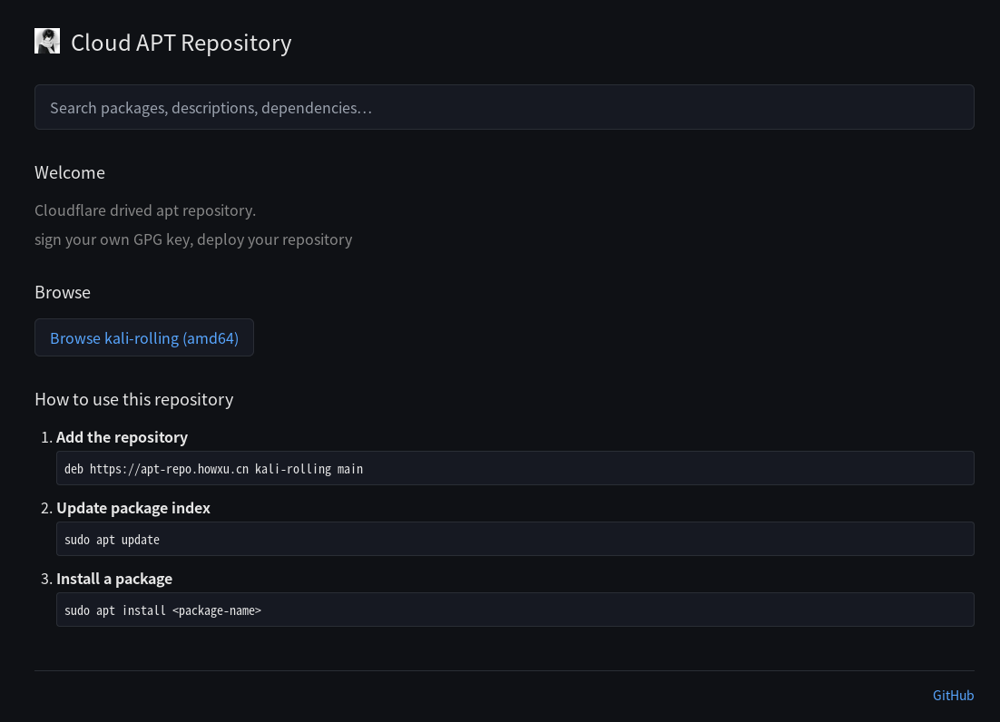

<p align="center">
    <h1 align="center">Cloud APT</h1>
    <p align="center">A lightweight private APT repository on Cloudflare Workers — one-click deploy 🎉</p>
    <p align="center">
        <a href="./README.md">中文</a>
    </p>
</p>



# Cloud APT

## Introduction

Deploy a private APT repository with a browse UI using just one Cloudflare Worker.

Supports local GPG signing + curl-based push; apt clients work directly. The Worker owns every `.deb` content-addressed in R2, so the local-repo only carries the signing key and a `packages.json` manifest.

Architectural pattern inspired by [cloud-maven](https://github.com/HowXu/cloud-maven).

## Features

- **One-click deploy** — Fork the repo, import via the Cloudflare Dashboard, no servers to manage
- **GPG signing** — Local GPG signing (ed25519); apt client strong verification passes
- **Vue 3 browse UI** — package list, details, and search
- **R2 object storage** — deb files + apt metadata pushed straight to R2, immutable per sha256
- **Worker push API** — `PUT /api/upload/{path}` with bearer token authentication
- **Multi-architecture support**

## Tech Stack

- **Runtime**: Cloudflare Workers
- **Web framework**: Hono
- **Frontend**: Vue 3 + TypeScript + Vite + UnoCSS
- **Storage**: Cloudflare R2 + Workers KV
- **Security**: Bearer Token, R2 private, GPG signing
- **Local**: GPG (ed25519) + curl + Python 3.10+ (stdlib only)

## Directory Structure

```
cloud-apt
├── apt-worker/           # Cloudflare Worker backend
├── apt-client/           # Vue 3 frontend
├── local-repo/           # Local repo template
│   ├── scripts/          # publish / migrate / init
│   │   ├── init.sh / push.sh / build-and-push.sh
│   │   ├── migrate-export.sh / migrate-import.sh
│   │   ├── push-key.sh / push-install.sh / gen-key.sh
│   │   ├── publish.py    # core: snapshot, upload by-hash, signed commit
│   │   ├── migrate.py    # core: export/import + GPG-encrypted config.env
│   │   ├── repo_state.py # shared: GPG home, repo lock, SHA256
│   │   └── lib-*.sh      # bash common
│   ├── conf/             # APT distribution metadata (Suite/Architectures/Components)
│   ├── keys/             # GPG key pair
│   └── packages.json     # catalog synced from the worker
└── example/              # Sample .deb packages for end-to-end testing
    ├── build.sh          # build
    ├── cloud-apt-hello/  # C, libc6
    └── cloud-apt-info/   # Python, python3

```

# Deployment Guide

## Cloudflare Deployment

### 1. Prepare Cloudflare resources

Fork this repository to your GitHub account.

### 2. Import from Git

Go to the [Cloudflare Dashboard](https://dash.cloudflare.com/) → **Workers & Pages** → **Create application** → **Create Worker** → **Connect to Git** → Select your forked repository.

Advanced settings:
- **Root directory**: `apt-worker`
- **Build command**: Leave empty (uses the `[build]` config in `wrangler.toml`)

### 3. Bind resources

Cloudflare auto-detects `wrangler.toml` and binds the KV namespace and R2 bucket. The config files are pre-written, so this is a one-click import.

To customize:
- KV namespace: name it `cloud-apt-kv`, copy the ID into `wrangler.toml`
- R2 bucket: name it `cloud-apt`

### 4. Set the Push Token

This step can only be done from the Worker dashboard; adjusting advanced settings during import is ineffective.

Worker → **Settings** → **Variables and Secrets** → **Add Secret**:

```
Name: ADMIN_PUSH_TOKEN
Value: <a strong secret>
```

### 5. Configure the R2 API token (for presigned uploads of files >100 MB)

Open **R2** → **Manage R2 API Tokens** → **Create API Token**:
- Permissions: Object Read & Write
- Bucket: pick the bucket bound to your Worker (default `cloud-apt`)

Add the following four values under Worker → **Settings** → **Variables and Secrets**:

| Name | Type | Value |
| --- | --- | --- |
| `R2_ACCESS_KEY_ID` | Secret | API token's `Access Key ID` |
| `R2_SECRET_ACCESS_KEY` | Secret | API token's `Secret Access Key` |
| `R2_ACCOUNT_ID` | Variable | Cloudflare account ID (visible on the R2 overview) |
| `R2_BUCKET_NAME` | Variable | Bucket name (default `cloud-apt`) |

Redeploy the Worker after saving.

### 6. Redeploy

Cloudflare currently triggers an automatic build after the Token is set, so you can skip this step.

Back in the Worker → **Deployments** → trigger a redeploy (e.g. push an empty commit).

### 7. Bind a custom domain (optional)

Worker → **Triggers** → **Custom Domains** → add `apt.example.com`.

## Pushing Packages

### 1. Local initialization

```bash
git clone https://github.com/HowXu/cloud-apt
cd cloud-apt
./local-repo/scripts/init.sh
```

`init.sh` prompts interactively for the Worker URL, upload Token, and GPG passphrase, then sets up the local repo structure, generates the GPG key, and uploads the public key and client install script.

This is a fully automated script — you only need to make sure your network and credentials are correct. If you mistype something or any step fails, just retry; Cloud APT has comprehensive recovery mechanisms.

### 2. Push

```bash
./local-repo/scripts/push.sh ../myapp_1.0_amd64.deb
```

`push.sh` prompts for the GPG passphrase, then generates a by-hash signed index, saves a publication snapshot, uploads and verifies all referenced files, and finally switches the current version.

After an interruption, you can re-run the same command. For full publishing and migration docs, see [local-repo/README.md](local-repo/README.md).

When upgrading, deploy the new Worker first, then use the new publish scripts.

## Client Usage

```bash
curl -fsSL https://apt.example.com/install.sh | sudo bash
# Or use the standard APT source method
sudo apt update && sudo apt install myapp
```

## Backup & Restore

### 1. Export repo state

```bash
./local-repo/scripts/migrate-export.sh /path/set-a-name.tar.gz
```

Contents:
- `keys`: encrypted private key, public key, and `keyid.txt`
- `conf`: APT distribution metadata
- `packages.json`: catalog of every deb the worker should serve
- `dists`: most recent signed indexes (optional; the worker keeps these too)
- `config.env.gpg`: `config.env` encrypted with `keys/public.key`


### 2. Import / restore

```bash
./local-repo/scripts/migrate-import.sh /path/set-a-name.tar.gz
./local-repo/scripts/push.sh --sync kali-rolling   # align packages.json with the server
./local-repo/scripts/push.sh path/to/package.deb
```

The import script automatically:
- Decrypts `config.env.gpg` to `local-repo/config.env` using the GPG private key
- Replaces the state subdirectories under `local-repo/`
- Backs up the previous state to `<target>.bak.<unique-suffix>`

## Development

```bash
# Local development
cd apt-worker
npm run dev

# Test
npm test

# Build
npm run build
```